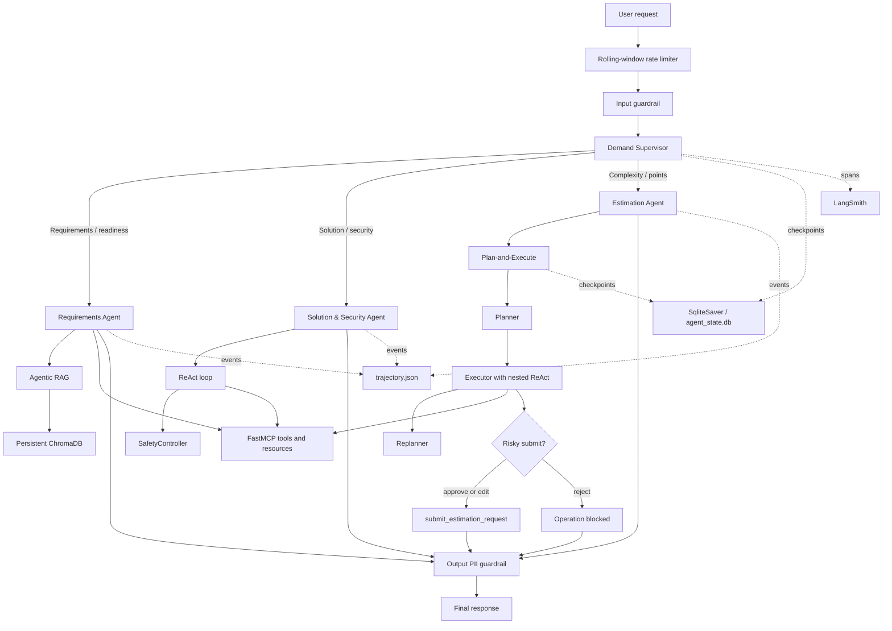

# Requirements & Estimation Multi-Agent System

Фінальний проєкт курсу **Autonomous Agent Design**: production-подібна мультиагентна система для підготовки business demand до оцінювання, аналізу requirements, solution/security review та розрахунку estimation.

Система об’єднує:

- LangGraph supervisor MAS із трьома спеціалізованими агентами;
- Agentic RAG із persistent ChromaDB;
- ReAct із SafetyController;
- Plan-and-Execute із вкладеним ReAct;
- FastMCP server, Resources і Prompt;
- Human-in-the-Loop для ризикової операції;
- SqliteSaver persistence і crash recovery;
- input, tool та output guardrails;
- rolling-window rate limiting;
- JSON trajectory logging з `agent_name`;
- LangSmith tracing;
- evaluation та red-team набори;
- альтернативну реалізацію того самого кейсу в AG2;
- виміряне порівняння LangGraph та AG2.

Проєкт перевірено на Python 3.13.2. Повний test suite: **47 passed**.

## 1. Бізнес-кейс

Business demand перед estimation проходить кілька взаємопов’язаних перевірок:

1. Чи достатньо визначені business objective, functional requirements, NFR, acceptance criteria, integrations і data requirements.
2. Чи є solution, integration, data або security gaps.
3. Якою є орієнтовна complexity та кількість Fibonacci points.
4. Чи дозволено виконати ризикову операцію фінального submit.
5. Чи можна відновити незавершений workflow після переривання процесу.

Один універсальний агент для цього процесу мав би одночасно працювати з knowledge base, виконувати reactive tool calling, будувати довгі плани, керувати approval та мати доступ до всіх інструментів. Це збільшило б context, tool surface і ризик помилкових дій.

Тому рішення реалізовано як supervisor MAS із розподілом відповідальності та інструментів.

## 2. Покриття вимог

| Вимога | Реалізація та доказ |
|---|---|
| LangGraph supervisor + 3 агенти | `mas_langgraph.py`, conditional routing, handoff trajectory |
| Plan-and-Execute агент | `plan_execute_agent.py`, Estimation Agent |
| Agentic RAG + ChromaDB | `knowledge.py`, Requirements Agent, 12 документів |
| ReAct агент | `react_agent.py`, Solution & Security Agent |
| SQLite persistence | Production supervisor MAS: `AsyncSqliteSaver` у `mas_langgraph.py`; nested Plan-and-Execute: `SqliteSaver` у `persistence_demo.py`; artifact: `agent_state.db` |
| Crash → resume same thread | `test_supervisor_mas_resumes_after_restart`, `test_persistence_resumes_same_thread` |
| Static `interrupt_before` | `test_static_interrupt_pauses_before_approval` |
| Dynamic HITL | `hitl.py`, approve/reject/edit через `Command(resume=...)` |
| Trajectory з `agent_name` | `trajectory_logger.py`, `trajectory.json` |
| FastMCP server | `mcp_server.py` |
| 4 MCP tools | readiness, complexity, gaps, submit |
| 2 MCP Resources | readiness і complexity standards |
| MCP Prompt | `prepare_estimation_handover` |
| MultiServerMCPClient | `mcp_client.py`, 2 integration demos |
| Input guardrail | EN/UA injection detection, heuristics, length limit |
| Tool guardrail | per-agent allowlist, Pydantic validation, risky-tool policy |
| Output guardrail | email, phone, card, IBAN, IPN, passport redaction |
| Rate limiter | rolling window per `session_id` |
| LangSmith | hierarchical trace, 35 runs, maximum depth 7 |
| Evaluation | `eval_results.json`, 6/6 passed |
| Red team | `red_team_results.json`, 6/6 passed |
| AG2 implementation | `mas_ag2.py` |
| 3-query comparison | `framework_benchmark.py` |
| Automated tests | 47 pytest tests |

## 3. Архітектура



## 4. Агенти та patterns

| Agent | Pattern | Відповідальність |
|---|---|---|
| Demand Supervisor | Conditional routing | Вибір specialist, handoff, route reasoning |
| Requirements Agent | Agentic RAG | Readiness, completeness, acceptance criteria, handover gaps |
| Solution & Security Agent | ReAct | Solution scope, integrations, data flows, NFR і security risks |
| Estimation Agent | Plan-and-Execute | Complexity, Fibonacci points, drivers, replanning і approval |

### 4.1 Demand Supervisor

Supervisor у `mas_langgraph.py`:

- отримує перевірений user request;
- формує structured `RouteDecision`;
- обирає рівно одного specialist agent;
- записує reasoning і handoff;
- не має доступу до ризикового submit tool;
- передає результат до output guardrail.

Доступні маршрути:

- `requirements_agent`;
- `solution_security_agent`;
- `estimation_agent`.

Невідомий route або відсутній specialist runner відхиляється детерміновано.

### 4.2 Requirements Agent — Agentic RAG

Requirements Agent відповідає за:

- Definition of Ready;
- completeness requirements;
- acceptance criteria;
- integration scope;
- data requirements;
- handover gaps.

Агент має доступ до:

- MCP readiness та handover tools;
- `search_delivery_knowledge`;
- persistent ChromaDB collection `requirements_estimation_knowledge`.

Knowledge base містить **12 доменних документів**. Агент сам вирішує, коли виконувати semantic search, тому це Agentic RAG, а не обов’язковий retrieval перед кожним запитом.

Фізичне сховище:

```text
chroma_db/
```

### 4.3 Solution & Security Agent — ReAct

Solution & Security Agent використовує цикл:

```text
LLM → tool → observation → LLM → final answer
```

Він аналізує:

- solution scope;
- integrations;
- data flows;
- security gaps;
- NFR;
- архітектурні ризики.

`SafetyController` обмежує виконання, виявляє повторні виклики та формує контрольований snapshot. Tool arguments проходять Pydantic validation, а результат зберігається в trajectory як `solution_security_agent`.

### 4.4 Estimation Agent — Plan-and-Execute

Estimation Agent реалізує:

```text
planner → executor → replanner → executor ... → finish
```

- `planner` створює structured `Plan`;
- `executor` виконує один крок через вкладений ReAct;
- `replanner` повертає structured `ReplanDecision`;
- risky submit переводить workflow до approval;
- результат містить complexity, Fibonacci points і score drivers.

`Plan` та `ReplanDecision` забороняють невідомі додаткові поля і валідують структуру LLM output.

## 5. State, routing і handoffs

Основний `MASState` містить:

- user request;
- `session_id`;
- current agent;
- route reasoning;
- specialist output;
- blocked/completed status;
- handoff count;
- trajectory events.

Перед supervisor виконуються:

1. rolling-window rate limit;
2. input inspection;
3. prompt-injection decision.

Після specialist виконується recursive output redaction.

Trajectory handoff містить:

- source agent;
- target agent;
- reasoning;
- timestamp;
- completion event;
- output processing event.

## 6. Persistence та crash recovery

Production supervisor MAS у `mas_langgraph.py` компілюється з `AsyncSqliteSaver` і зберігає верхній `MASState` у файлі:

```text
agent_state.db
```

Фактичний production demo зберіг checkpoints усіх трьох маршрутів:

```text
mas-requirements: 15 checkpoints
mas-security: 10 checkpoints
mas-estimation: 6 checkpoints
```

Інтеграційний тест `test_supervisor_mas_resumes_after_restart` виконує повний offline-сценарій без LLM та мережевих викликів:

1. Запускає supervisor MAS з унікальним `thread_id`.
2. Supervisor маршрутизує request до Requirements Agent.
3. `interrupt_before` зупиняє MAS перед specialist node.
4. Async SQLite connection закривається, імітуючи crash.
5. Новий connection і новий compiled graph читають збережений checkpoint.
6. MAS продовжує виконання з тим самим `thread_id`.
7. Тест перевіряє selected agent, handoff count і completed state.

Окремий `persistence_demo.py` зберігає попередню Plan-and-Execute демонстрацію та static approval breakpoint:

```text
checkpoint_survived_restart: true
paused_before_executor: true
resumed_with_same_thread: true
```

Таким чином, `agent_state.db` містить як checkpoints вкладеного Plan-and-Execute workflow, так і persisted state верхнього supervisor MAS.

Запуск доказових сценаріїв:

```bash
python mas_langgraph.py
python persistence_demo.py
python -m pytest -v tests/test_persistence.py
```

## 7. Human-in-the-Loop і коментар ментора

У проєкті навмисно присутні два різні механізми паузи.

### 7.1 Static breakpoint через `interrupt_before`

`plan_execute_agent.build_graph()` приймає:

```python
interrupt_before: list[str] | None
interrupt_after: list[str] | None
```

і передає їх безпосередньо до:

```python
builder.compile(
    checkpointer=checkpointer,
    interrupt_before=interrupt_before,
    interrupt_after=interrupt_after,
)
```

`persistence_demo.py` окремо доводить, що graph зупиняється **до входу** в `approval` node:

```text
paused_before: approval
dynamic_interrupt_entered: false
```

Це прямо враховує коментар ментора до попередньої роботи: breakpoint має бути параметром `compile()`, а не лише викликом усередині node.

### 7.2 Dynamic HITL через `interrupt()`

Для реального рішення користувача використано сучасний LangGraph flow:

```text
interrupt() → human decision → Command(resume=...)
```

Підтримуються три рішення:

- `approve` — виконати risky tool;
- `reject` — заблокувати операцію;
- `edit` — змінити arguments, повторно валідувати й лише потім виконати.

Static і dynamic pause демонструються окремо. Вони не вмикаються одночасно для одного approval flow, оскільки це створило б подвійну паузу.

Тести:

- `test_approve_executes_risky_tool`;
- `test_reject_blocks_risky_tool`;
- `test_edit_revalidates_and_executes`;
- `test_static_interrupt_pauses_before_approval`.

## 8. MCP Server

`mcp_server.py` реалізовано через FastMCP.

### 8.1 Tools

| Tool | Призначення | Side effect |
|---|---|---:|
| `check_requirements_readiness` | Перевіряє шість обов’язкових requirements fields | Ні |
| `classify_estimation_complexity` | Розраховує complexity та Fibonacci points | Ні |
| `identify_handover_gaps` | Визначає blocking gaps перед handover | Ні |
| `submit_estimation_request` | Зберігає фінальний estimation request | Так, потребує HITL |

Кожний tool має:

- чіткий опис для LLM;
- Pydantic v2 input model;
- `Field` constraints і validators;
- стандартний JSON result;
- контрольоване повідомлення про помилку.

Стандартна структура відповіді:

```json
{
  "status": "success",
  "data": {},
  "error": null
}
```

### 8.2 Resources

| URI | Вміст |
|---|---|
| `demand://standards/readiness` | Definition of Ready та required fields |
| `demand://standards/complexity` | Правила complexity та Fibonacci mapping |

Resources відокремлюють стабільні доменні стандарти від інструментів, які виконують обчислення або side effects.

### 8.3 Prompt

Prompt `prepare_estimation_handover` формує повторно використовуваний workflow:

1. прочитати readiness Resource;
2. перевірити requirements readiness;
3. визначити handover gaps;
4. розрахувати complexity;
5. не виконувати submit без HITL;
6. не вигадувати відсутні значення.

### 8.4 MCP integration

`mcp_client.py` використовує `MultiServerMCPClient` і stdio transport.

Два інтеграційні сценарії:

- `requirements_readiness`;
- `complexity_estimation`.

Доказ:

```text
artifacts/mcp_integration_demo.json
```

Запуск:

```bash
python mcp_client.py
```

MCP test suite містить дев’ять async тестів, включно з tools, Resources і Prompt.

## 9. Security hardening

### 9.1 Input guardrail

Input inspection виконується до supervisor і перевіряє:

- direct prompt injection;
- indirect prompt injection patterns;
- jailbreak/bypass формулювання;
- спроби відкрити system prompt;
- англомовні та україномовні атаки;
- null characters;
- порожній input;
- максимальну довжину 8000 символів.

Заблокований request не потрапляє до supervisor або specialist agents.

### 9.2 Tool guardrail

Tool policy містить окремий allowlist для кожного agent role.

Перед виконанням перевіряються:

1. agent identity;
2. tool name;
3. належність tool до allowlist;
4. Pydantic argument schema;
5. risky-tool classification;
6. human approval для side effect.

Supervisor не може виконати `submit_estimation_request`.

### 9.3 Output guardrail

Recursive redaction працює зі strings, lists, tuples та nested dictionaries.

Підтримуються:

- email;
- phone number;
- payment card з Luhn validation;
- український IBAN;
- контекстний IPN/RNOKPP;
- український passport booklet;
- ID-card passport.

Маркери redaction:

```text
[EMAIL_REDACTED]
[PHONE_REDACTED]
[CARD_REDACTED]
[IBAN_UA_REDACTED]
[IPN_REDACTED]
[PASSPORT_REDACTED]
```

### 9.4 Rolling-window rate limiter

`RollingWindowRateLimiter`:

- працює окремо для кожного `session_id`;
- використовує rolling time window;
- не блокує інші sessions;
- виконується до supervisor;
- має thread-safe state;
- підтримує injected clock для детермінованих тестів.

## 10. OWASP Top 10 for Agentic Applications 2026

Матриця використовує офіційні назви
[OWASP Top 10 for Agentic Applications](https://genai.owasp.org/2025/12/09/owasp-top-10-for-agentic-applications-the-benchmark-for-agentic-security-in-the-age-of-autonomous-ai/).

| Risk | Контроль у проєкті | Статус і residual risk |
|---|---|---|
| ASI01 Agent Goal Hijack | EN/UA injection detection, structured routing, scope-specific prompts | Частково mitigated. Семантично нова paraphrased injection може пройти regex |
| ASI02 Tool Misuse & Exploitation | Per-agent allowlist, Pydantic validation, risky-tool HITL | Mitigated для наявних tools; policy треба оновлювати при додаванні нових tools |
| ASI03 Identity & Privilege Abuse | Явні agent roles, least-privilege tool scopes, supervisor без submit | Частково mitigated. Agent identity логічна, без зовнішнього IAM або cryptographic identity |
| ASI04 Agentic Supply Chain Vulnerabilities | Pinned dependencies, локальний MCP server, stdio transport | Частково mitigated. Немає SBOM, signature verification або dependency attestation |
| ASI05 Unexpected Code Execution | Немає shell/code-execution tool, typed arguments, fixed tool registry | Mitigated на application layer; Python dependencies залишаються частиною trusted runtime |
| ASI06 Memory & Context Poisoning | Curated 12-document knowledge base, local ChromaDB, filtered input | Частково mitigated. Немає cryptographic document provenance та automatic rollback |
| ASI07 Insecure Inter-Agent Communication | Typed `MASState`, structured route, named handoffs, trajectory audit | Частково mitigated. `agent_name` не є cryptographic proof of identity |
| ASI08 Cascading Failures | Step limits, controlled routing, rate limiter, checkpoints, blocked-state propagation | Mitigated для відомих flows; provider outage або помилка вкладеного workflow може вплинути на latency |
| ASI09 Human-Agent Trust Exploitation | Route reasoning, explicit gaps, HITL, approve/reject/edit | Частково mitigated. Людина все одно може механічно approve неправильну рекомендацію |
| ASI10 Rogue Agents | Supervisor control, allowlists, completion states, audit logs, no unrestricted tools | Частково mitigated. Немає runtime attestation або незалежного policy enforcement service |

## 11. Trajectory logging

`trajectory_logger.py` зберігає:

- `run_id`;
- timestamp;
- `agent_name`;
- `agent_type`;
- user input;
- serialized messages;
- tool calls;
- final response;
- safety snapshot;
- metadata;
- supervisor trajectory events.

`agent_name` присутній:

- на рівні кожного run;
- у кожному serialized message;
- у supervisor handoff metadata.

Фактично збережені агенти:

```text
requirements_agent
solution_security_agent
estimation_agent
```

Файл:

```text
trajectory.json
```

## 12. Observability і LangSmith

LangSmith tracing вмикається через `.env`:

```dotenv
LANGSMITH_TRACING=true
LANGSMITH_API_KEY=
LANGSMITH_PROJECT=hw3-malkova-demand-mas
LANGSMITH_ENDPOINT=https://api.smith.langchain.com
```

Останній експортований production trace:

| Metric | Value |
|---|---:|
| Root run | `LangGraph` |
| Runs | 35 |
| Maximum hierarchy depth | 7 |
| Chain runs | 24 |
| LLM runs | 6 |
| Parser runs | 4 |
| Tool runs | 1 |
| Prompt tokens | 33,812 |
| Completion tokens | 4,078 |
| Total tokens | 37,890 |

Trace:

[Open the LangSmith trace](https://smith.langchain.com/o/7fe73952-db63-4588-b1f2-a4740b72671c/projects/p/17232174-d91e-4921-9a8b-8bb4ede55688/r/01a00c47-eb22-75a2-9744-dd6395c76d42?poll=true)

Локальний hierarchical export:

```text
artifacts/langsmith_trace.json
```

Запуск нового trace та export:

```bash
python tracing_config.py
python export_langsmith_trace.py
```

Trace export містить:

- `trace_id`;
- root run;
- `parent_run_id`;
- hierarchy depth;
- run type;
- inputs/outputs;
- token usage;
- errors;
- timestamps.

## 13. Evaluation

`evaluation.py` виконує шість сценаріїв через реальні routing, guardrail і domain-tool компоненти.

Кожний result містить:

- `scenario_id`;
- `query`;
- `expected`;
- `actual`;
- `pass`;
- `latency_ms`;
- `agents_used`;
- `tools_called`.

Результат:

```text
Evaluation scenarios: 6/6 passed
```

Файл:

```text
eval_results.json
```

Запуск:

```bash
python evaluation.py
```

## 14. Red teaming

`red_team.py` перевіряє шість attack scenarios:

- prompt injection;
- PII leakage;
- scope confusion;
- tool misuse;
- jailbreak;
- rate-limit abuse.

Для кожної атаки збережено:

- attack type;
- input;
- expected protection;
- actual result;
- pass/fail;
- residual risk.

Результат:

```text
Red-team scenarios: 6/6 passed
```

Файл:

```text
red_team_results.json
```

Запуск:

```bash
python red_team.py
```

## 15. LangGraph та AG2

Той самий Requirements & Estimation MAS реалізовано у двох frameworks:

- LangGraph — `mas_langgraph.py`;
- AG2 v1 — `mas_ag2.py`.

Benchmark виконує три еквівалентні запити:

1. requirements readiness;
2. solution/security analysis;
3. complexity estimation.

Routing correctness:

```text
3/3 scenarios passed
```

### 15.1 Виміряне використання моделі

| Framework | Model calls | Prompt tokens | Completion tokens | Total tokens |
|---|---:|---:|---:|---:|
| LangGraph | 13 | 8,608 | 1,346 | 9,954 |
| AG2 v1 | 8 | 3,059 | 1,996 | 5,055 |

У цьому трьохзапитному snapshot AG2 використав приблизно на 49.2% менше total tokens. Це не універсальна властивість framework: LangGraph реалізація виконує глибші specialist workflows, nested ReAct, planning та ширшу observability hierarchy.

### 15.2 Інженерне порівняння

| Критерій | LangGraph | AG2 v1 |
|---|---:|---:|
| Контроль flow, 1–5 | 5 | 3 |
| Debugging, 1–5 | 5 | 3 |
| Зафіксований implementation time | 420 хв | 90 хв |
| Routing scenarios | 3/3 | 3/3 |
| Token accounting | LangSmith trace | Native `AgentReply.usage()` |
| State graph visibility | Explicit nodes/edges/state | Supervisor-to-specialist orchestration |
| Persistence customization | Висока | Нижча в цій реалізації |

LOC розраховано автоматично через Python AST, а exact per-file та total values збережено разом із latency і token details:

- `artifacts/framework_benchmark.json`;
- `artifacts/framework_comparison.md`.

Development time є зафіксованою оцінкою часу coursework implementation, а не автоматично виміряним production metric.

Запуск:

```bash
python mas_ag2.py
python framework_benchmark.py
```

## 16. Аналітичні питання

Цей розділ окремо закриває вимогу README з відповідями на п’ять аналітичних питань і враховує попередній коментар ментора.

### 16.1 Чому обрано supervisor architecture, а не swarm?

Demand workflow має чіткі business domains і контрольовані handoff rules. Один supervisor дозволяє:

- централізовано виконати input guardrail;
- вибрати лише одного specialist;
- не передавати user request між агентами без потреби;
- контролювати tool exposure;
- однозначно записати route reasoning;
- завершити flow після одного specialist result.

Swarm був би корисним для відкритої collaboration, де наперед невідомо, який agent має бути наступним. Тут це збільшило б nondeterminism, кількість model calls і ризик scope confusion.

### 16.2 Чому агентам призначено різні agentic patterns?

Requirements Agent використовує Agentic RAG, тому що його рішення залежать від доменних стандартів і Definition of Ready.

Solution & Security Agent використовує ReAct, тому що він має ітеративно обирати перевірки на основі знайдених gaps.

Estimation Agent використовує Plan-and-Execute, тому що complexity assessment складається з кількох залежних кроків, потребує progress evaluation і може перейти до replanning або HITL.

Розподіл patterns відповідає природі задач, а не лише демонструє три різні технології.

### 16.3 Як система відновлюється після crash і чому потрібен той самий `thread_id`?

SqliteSaver зберігає state snapshot поза Python process. Після закриття першого connection новий runtime відкриває `agent_state.db` і звертається до того самого checkpoint namespace через той самий `thread_id`.

Новий `thread_id` створив би незалежний workflow. Повторне використання старого ідентифікатора дозволяє `get_state()` знайти paused node, plan, current step і results, після чого `invoke(None, config)` продовжує існуючий run.

### 16.4 Чому реалізовано і `interrupt_before`, і dynamic `interrupt()`?

`interrupt_before` є static breakpoint на рівні compiled graph. Він корисний для debugging, persistence demonstration і гарантованої паузи до входу у визначений node. Саме цього бракувало у попередній роботі за коментарем ментора.

Dynamic `interrupt()` виконується всередині approval logic і передає людині конкретний payload risky action. `Command(resume=...)` повертає approve, reject або edited arguments.

Це різні рівні контролю. У проєкті вони перевіряються окремо, щоб не створювати double interrupt.

### 16.5 Які обмеження не дозволяють назвати систему повністю production-ready?

Проєкт є production-подібним, але для реального bank environment потрібні додаткові controls:

1. Cryptographic service/agent identity та enterprise IAM замість логічного `agent_name`.
2. Managed database, encryption, backup і retention policy замість локальних SQLite/Chroma files.
3. Central policy enforcement, secrets manager, network isolation, SBOM і signed dependencies.
4. Model-based injection detection на додаток до regex/heuristics.
5. Human approval UI з authentication, audit signature і separation of duties.
6. Statistical evaluation на більшій вибірці та регулярний regression benchmark.

## 17. Residual risks

### 17.1 Semantic prompt injection

Regex і heuristics блокують відомі EN/UA patterns, але нова непряма або сильно перефразована інструкція може пройти input guardrail.

Production mitigation: окремий injection classifier, content provenance, sandboxed retrieval і policy model.

### 17.2 Memory та knowledge poisoning

ChromaDB наповнено локальним curated набором, але documents не мають cryptographic signatures.

Production mitigation: trusted ingestion pipeline, document versioning, hashes, approval та rollback.

### 17.3 Human approval fatigue

HITL зупиняє risky tool, але людина може формально натиснути approve без перевірки.

Production mitigation: risk-based approval, concise evidence, dual control для high-impact actions і reversible execution.

## 18. Структура проєкту

```text
final_mas/
├── mas_langgraph.py
├── mas_ag2.py
├── specialist_runners.py
├── react_agent.py
├── plan_execute_agent.py
├── knowledge.py
├── safety.py
├── tools_legacy.py
├── mcp_server.py
├── mcp_client.py
├── guardrails.py
├── advanced_guardrails.py
├── hitl.py
├── legacy_hitl.py
├── persistence_demo.py
├── trajectory_logger.py
├── tracing_config.py
├── export_langsmith_trace.py
├── evaluation.py
├── red_team.py
├── framework_benchmark.py
├── agent_state.db
├── trajectory.json
├── eval_results.json
├── red_team_results.json
├── chroma_db/
├── artifacts/
├── tests/
├── requirements.txt
├── .env.example
└── README.md
```

Основні призначення:

| Файл | Призначення |
|---|---|
| `mas_langgraph.py` | LangGraph supervisor MAS |
| `mas_ag2.py` | альтернативна AG2 реалізація |
| `specialist_runners.py` | adapters для specialist patterns |
| `react_agent.py` | ReAct Solution & Security Agent |
| `plan_execute_agent.py` | Plan-and-Execute Estimation Agent |
| `knowledge.py` | Agentic RAG і ChromaDB |
| `safety.py` | ReAct SafetyController |
| `mcp_server.py` | FastMCP tools, Resources і Prompt |
| `mcp_client.py` | MultiServerMCPClient integration |
| `guardrails.py` | input, tool та output policy |
| `advanced_guardrails.py` | advanced PII і rate limiter |
| `hitl.py` | dynamic approve/reject/edit HITL |
| `persistence_demo.py` | SQLite crash/resume demo |
| `trajectory_logger.py` | JSON trajectory з `agent_name` |
| `evaluation.py` | evaluation scenarios |
| `red_team.py` | adversarial scenarios |
| `framework_benchmark.py` | LangGraph/AG2 benchmark |

## 19. Встановлення

З кореня repository:

```bash
cd final_mas

python3.13 -m venv .venv
source .venv/bin/activate

python -m pip install --upgrade pip
python -m pip install -r requirements.txt
```

Перевірка dependency consistency:

```bash
python -m pip check
```

## 20. Configuration

Створити локальний `.env`:

```bash
cp .env.example .env
```

Заповнити:

```dotenv
GOOGLE_API_KEY=your_google_api_key
MODEL_NAME=gemini-3.1-flash-lite

LANGSMITH_TRACING=true
LANGSMITH_API_KEY=your_langsmith_api_key
LANGSMITH_PROJECT=hw3-malkova-demand-mas
LANGSMITH_ENDPOINT=https://api.smith.langchain.com
```

`.env` і `.venv/` виключені через `.gitignore`.

Не потрібно одночасно задавати `GOOGLE_API_KEY` і `GEMINI_API_KEY`: достатньо `GOOGLE_API_KEY`.

## 21. Запуск

### LangGraph MAS

```bash
python mas_langgraph.py
```

Demo містить три типи query:

- requirements readiness;
- solution/security analysis;
- estimation.

### AG2 MAS

```bash
python mas_ag2.py
```

### MCP server

```bash
python mcp_server.py
```

Server працює через stdio transport.

### MCP integration demos

```bash
python mcp_client.py
```

### Persistence

```bash
python persistence_demo.py
```

### Evaluation

```bash
python evaluation.py
```

### Red team

```bash
python red_team.py
```

### LangSmith trace

```bash
python tracing_config.py
python export_langsmith_trace.py
```

### Framework benchmark

```bash
python framework_benchmark.py
```

## 22. Тестування

Запускати pytest потрібно саме з `final_mas`, оскільки repository містить попередні assignments із файлами однакових назв.

```bash
cd final_mas
python -m pytest -v
```

Поточний результат:

```text
47 passed in 4.64s
```

Розподіл перевірок:

| Група | Кількість |
|---|---:|
| Guardrails і rate limiting | 14 |
| Dynamic HITL | 3 |
| LangGraph MAS | 8 |
| AG2 MAS | 5 |
| MCP tools/resources/prompt | 9 |
| Persistence і static interrupt | 2 |
| Trajectory logger | 1 |
| Required artifacts | 4 |
| Разом | 46 |

Окремі команди:

```bash
python -m pytest -v tests/test_guardrails.py
python -m pytest -v tests/test_hitl.py
python -m pytest -v tests/test_mas.py
python -m pytest -v tests/test_mas_ag2.py
python -m pytest -v tests/test_mcp_server.py
python -m pytest -v tests/test_persistence.py
python -m pytest -v tests/test_trajectory_logger.py
python -m pytest -v tests/test_artifacts.py
```

## 23. Доказові артефакти

| Artifact | Призначення |
|---|---|
| `agent_state.db` | SQLite checkpoints після crash/resume |
| `trajectory.json` | specialist runs і supervisor handoffs |
| `eval_results.json` | 6 evaluation scenarios |
| `red_team_results.json` | 6 red-team scenarios |
| `artifacts/langsmith_trace.json` | hierarchical LangSmith export |
| `artifacts/langsmith_run_output.txt` | output traced production run |
| `artifacts/mas_demo_output.txt` | три LangGraph business queries |
| `artifacts/ag2_smoke_output.txt` | AG2 execution evidence |
| `artifacts/mcp_integration_demo.json` | MultiServerMCPClient demos |
| `artifacts/framework_benchmark.json` | detailed benchmark metrics |
| `artifacts/framework_comparison.md` | human-readable comparison |
| `artifacts/framework_benchmark_output.txt` | benchmark console output |
| `artifacts/pytest_output.txt` | full pytest evidence |

## 24. Підсумок

Проєкт реалізує повний Requirements & Estimation agentic workflow:

- controlled supervisor routing;
- три агенти з різними patterns;
- persistent Agentic RAG;
- Plan-and-Execute і nested ReAct;
- static та dynamic interrupts;
- MCP tools, Resources і Prompt;
- persistent checkpoints;
- trajectory audit;
- guardrails і rate limiting;
- evaluation, red teaming та observability;
- реальне порівняння LangGraph і AG2.

Коментарі ментора до попередньої роботи враховано:

1. `interrupt_before` передається в `compile()` і перевіряється окремим тестом.
2. README містить окремі відповіді на п’ять аналітичних питань.

Усі automated acceptance checks проходять успішно: **47/47**.
