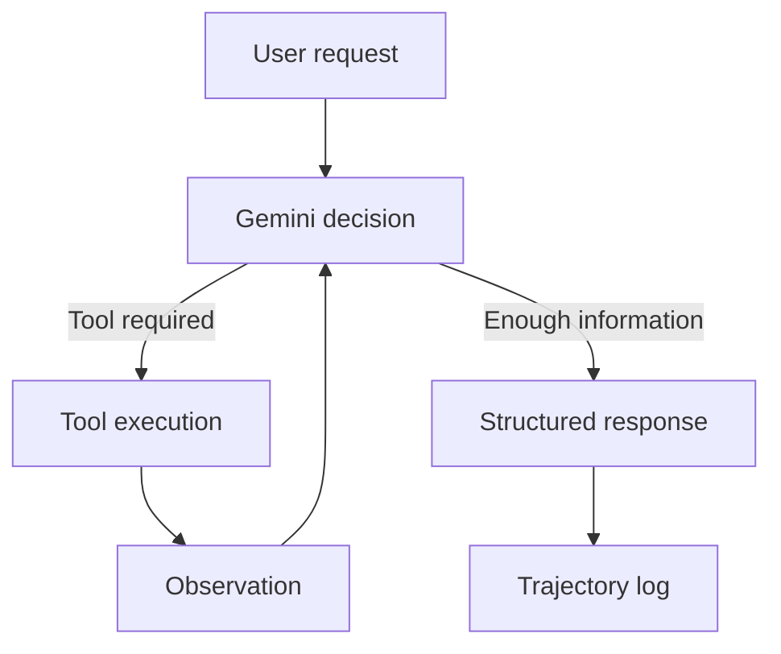

# HW1 — Demand & Discovery ReAct Agent

Навчальний ReAct-агент на базі LangGraph, LangChain і Gemini API для супроводу demand-ініціатив та попередньої оцінки discovery.

Агент уміє:

- знаходити поточний статус ініціативи;
- перевіряти повноту intake;
- розраховувати Discovery Points за шкалою Fibonacci;
- рекомендувати Light, Standard або Deep discovery;
- розраховувати priority score за оцінками, заданими людиною;
- запитувати відсутні дані замість їх вигадування.

## Архітектура



ReAct-цикл реалізований вручну через `StateGraph`:

1. LLM аналізує запит.
2. Обирає потрібний інструмент.
3. LangGraph виконує tool call.
4. Результат повертається моделі як observation.
5. Модель продовжує цикл або формує відповідь.
6. Фінальна відповідь перевіряється Pydantic-схемою.

## Інструменти

| Tool | Призначення |
|---|---|
| `get_initiative_status` | Повертає статус синтетичної demand-ініціативи |
| `check_intake_completeness` | Перевіряє обов’язкові поля Gate 0 |
| `classify_discovery_scope` | Розраховує Discovery Points та рекомендує scope |
| `calculate_priority_score` | Розраховує priority score за людськими оцінками |

Усі інструменти використовують Pydantic-схеми та повертають стандартний JSON:

```json
{
  "status": "success",
  "data": {},
  "error": null
}
```

## Discovery Points

Для оцінювання використовуються лише явно надані параметри:

- кількість систем;
- зрозумілість ownership;
- технічна невизначеність;
- зовнішні залежності;
- регуляторний вплив;
- готовність даних.

Raw score переводиться у Fibonacci:

| Raw score | Discovery Points |
|---:|---:|
| 0–1 | 1 |
| 2–3 | 2 |
| 4–5 | 3 |
| 6–7 | 5 |
| 8–10 | 8 |
| 11–14 | 13 |

Відповідність scope:

| Discovery Points | Scope |
|---:|---|
| 1–2 | Light |
| 3–5 | Standard |
| 8–13 | Deep |

Ініціатива, яка зачіпає три або більше систем, отримує щонайменше Standard scope.

Результат є рекомендацією агента і потребує підтвердження Lead Business Analyst.

## Priority Score

Критерії оцінюються людиною від 1 до 5:

| Criterion | Weight |
|---|---:|
| Strategic alignment | 30% |
| Customer impact | 25% |
| Financial impact | 20% |
| Regulatory urgency | 15% |
| Implementation feasibility | 10% |

Агент не визначає значення критеріїв самостійно — він лише виконує розрахунок.

## Safety controls

Реалізовано три рівні захисту:

- `max_steps=8` — максимальна кількість LLM-кроків;
- `timeout_seconds=60` — обмеження тривалості запуску;
- `repeated_call_limit=2` — зупинка після повторення однакового tool call.

Для кожного запуску створюється окремий `SafetyController`.

## Встановлення

Потрібен Python 3.13 або сумісна версія.

```bash
python3 -m venv .venv
source .venv/bin/activate
pip install -r requirements.txt
```

Створити файл `.env`:

```env
GOOGLE_API_KEY=your_api_key
```

Файл `.env` виключений з Git і не повинен потрапляти до репозиторію.

## Запуск

Інтерактивний режим:

```bash
python agent.py
```

Приклад запиту:

```text
Какой статус у инициативы DEM-001?
```

Для завершення:

```text
exit
```

## Тестування

Unit-тести:

```bash
pytest -q
```

Поточний результат:

```text
11 passed
```

End-to-end сценарії з реальною моделлю:

```bash
python test_runner.py
```

Поточний результат:

```text
5/5 passed
```

Між сценаріями використовується пауза через обмеження Gemini Free Tier.

## Артефакти

- `trajectory.json` — повна ReAct-траєкторія: human → AI tool call → tool observation → AI response.
- `test_results.json` — результати п’яти end-to-end сценаріїв.
- `test_tools.py` — unit-тести інструментів.
- `test_safety.py` — unit-тести safety controls.

## Структура проєкту

```text
hw1_react_agent/
├── agent.py
├── tools.py
├── safety.py
├── trajectory_logger.py
├── test_runner.py
├── test_tools.py
├── test_safety.py
├── trajectory.json
├── test_results.json
├── requirements.txt
├── README.md
├── .env
└── .gitignore
```

## Модель

Використовується `gemini-3.1-flash-lite`, оскільки рекомендована в початковому завданні `gemini-2.5-flash` більше не доступна новим користувачам Gemini API.

Модель підтримує function calling та structured output.

## Аналіз результатів тестування

Агент протестований на п’яти end-to-end сценаріях різної складності. Усі сценарії пройдено успішно: **5 із 5**, success rate — **100%**.

| Test ID | Складність | Результат | Кроки | Викликані tools | Час, с |
|---|---|---:|---:|---|---:|
| TC-001 | simple | PASS | 3 | `get_initiative_status` | 2.696 |
| TC-002 | medium | PASS | 3 | `check_intake_completeness` | 4.417 |
| TC-003 | complex | PASS | 3 | `classify_discovery_scope` | 6.314 |
| TC-004 | complex | PASS | 3 | `calculate_priority_score` | 2.670 |
| TC-005 | medium | PASS | 2 | без виклику tool | 6.194 |

Повні результати з expected result, actual result, кількістю кроків, викликами tools і часом виконання збережені у файлі `test_results.json`. Повні траєкторії взаємодії LLM–tools–LLM збережені у `trajectory.json`.

### Де агент працює добре

Агент правильно вибрав потрібний інструмент у всіх сценаріях, де для відповіді був необхідний tool:

- для отримання статусу ініціативи використано `get_initiative_status`;
- для перевірки intake використано `check_intake_completeness`;
- для визначення Discovery scope та Discovery Points використано `classify_discovery_scope`;
- для розрахунку пріоритету використано `calculate_priority_score`.

У сценарії TC-005 агент правильно визначив, що вхідних параметрів недостатньо, не викликав tool із неповними даними та повернув статус `needs_input` із переліком відсутніх полів.

### Помилки та причини

У фінальному запуску помилок і пропущених обов’язкових tools не зафіксовано. Усі фактичні результати відповідали очікуваним статусам, ключовим словам і викликам tools.

Під час попередніх запусків виникали помилки `RESOURCE_EXHAUSTED` через обмеження Gemini API free tier. Це інфраструктурне обмеження, а не помилка бізнес-логіки агента. Для стабільного запуску між end-to-end сценаріями додано паузу.

### Прості та складні сценарії

Простий сценарій TC-001 потребував трьох кроків: повідомлення користувача, виклику tool та фінальної відповіді агента.

Складні сценарії TC-003 і TC-004 також завершилися за три кроки, оскільки користувач одразу надав усі необхідні структуровані параметри. Це показує, що кількість кроків залежить не лише від складності бізнес-розрахунку, а й від повноти вхідних даних.

TC-005 завершився за два кроки без виклику tool: агент проаналізував запит і одразу запросив відсутні параметри.

### Max steps, timeout і повторні виклики

Для одного запуску встановлено:

- `max_steps = 8`;
- загальний `timeout = 60` секунд;
- обмеження повторення однакового tool call.

Максимальна фактична кількість кроків у тестах становила **3 із 8**, а максимальний час виконання — **6.314 із 60 секунд**. Жоден сценарій не досяг safety-лімітів.

### Latency та складність

Час виконання становив від **2.670** до **6.314** секунди. Найдовшим був TC-003 із розрахунком Discovery Points, але залежність між бізнес-складністю та latency не є лінійною: складний TC-004 виконався швидше за деякі простіші сценарії.

Основним джерелом варіативності є час відповіді зовнішньої LLM, оскільки самі tools виконують локальні детерміновані розрахунки.

### Висновки та обмеження

Реалізований ReAct-агент коректно проходить цикл LLM–tools–LLM, обирає потрібні tools, не запускає розрахунки без обов’язкових даних і позначає результати, що потребують підтвердження людини.

Поточні обмеження:

- дані про ініціативи зберігаються у локальному mock-наборі;
- маршрутизація запитів залежить від поведінки зовнішньої LLM;
- підтвердження людини позначається у відповіді, але ще не зберігається у зовнішній workflow-системі;
- швидкість і доступність агента залежать від Gemini API та його quota limits;
- для production-рішення потрібні інтеграції з Jira, постійне сховище, authentication, monitoring і централізоване логування.
