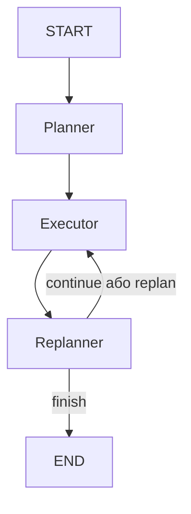

# HW2 — Plan-and-Execute Agent з Memory, Agentic RAG та HITL

Навчальний AI-агент для супроводу Demand & Discovery ініціатив.

Рішення розвиває бізнес-сценарій із HW1: агент перевіряє повноту intake, визначає Discovery scope та Discovery Points, знаходить релевантні правила у knowledge base і за явним підтвердженням людини відправляє фінальний Discovery assessment.

## Реалізовані вимоги

- Plan-and-Execute архітектура на LangGraph.
- Три основні вузли: `planner`, `executor`, `replanner`.
- Структурований план `Plan`.
- Структуроване рішення `ReplanDecision`.
- Послідовне виконання одного tool за один крок.
- Чотири tools із Pydantic-валідацією.
- Agentic RAG із ChromaDB та top-3 retrieval.
- File-backed persistence через `SqliteSaver`.
- Відновлення виконання після перезапуску процесу.
- Незалежні стани для різних `thread_id`.
- Human-in-the-Loop через `interrupt()` і `Command(resume=...)`.
- Рішення `approve`, `reject` та `edit` для ризикової дії.
- Unit, integration та acceptance tests.

## Бізнес-сценарій

Агент супроводжує підготовку Demand & Discovery assessment:

1. Перевіряє Gate 0 — повноту intake.
2. Розраховує складність discovery.
3. Перетворює складність на Fibonacci Discovery Points.
4. Рекомендує `Light`, `Standard` або `Deep`.
5. Самостійно вирішує, коли потрібно звернутися до knowledge base.
6. Перед фінальною відправкою assessment запитує підтвердження людини.

Discovery Points:

- `1–2` — Light;
- `3–5` — Standard;
- `8–13` — Deep.

## Архітектура



### Planner

`planner` отримує запит користувача та формує структурований об’єкт `Plan`:

```python
class Plan(BaseModel):
    goal: str
    steps: list[str]
```

Кожен крок починається з назви tool, який потрібно використати. План містить від одного до шести унікальних кроків.

### Executor

`executor` виконує рівно один поточний крок плану за одну ітерацію.

Він:

- передає LLM лише доступні tools;
- дозволяє моделі вибрати потрібний tool та аргументи;
- виконує tool;
- зберігає результат у state;
- збільшує `current_step`;
- передає управління `replanner`.

Якщо обрано ризиковий `submit_discovery_assessment`, executor викликає HITL interrupt до виконання операції.

### Replanner

`replanner` аналізує план і накопичені observations та повертає структурований `ReplanDecision`:

```python
class ReplanDecision(BaseModel):
    action: Literal["continue", "replan", "finish"]
    updated_steps: list[str]
    reasoning: str
    final_answer: str | None
```

Можливі рішення:

- `continue` — перейти до наступного кроку;
- `replan` — замінити лише невиконану частину плану;
- `finish` — завершити роботу й сформувати фінальну відповідь.

Кількість replanning обмежена для захисту від нескінченного циклу.

## Tools

| Tool | Призначення | Ризик |
|---|---|---:|
| `check_intake_completeness` | Перевіряє п’ять обов’язкових Gate 0 полів | Низький |
| `classify_discovery_scope` | Розраховує Discovery Points та рекомендує scope | Низький |
| `search_knowledge` | Виконує semantic search у ChromaDB та повертає top-3 | Низький |
| `submit_discovery_assessment` | Фіксує фінальний Discovery assessment | Високий |

Усі аргументи tools перевіряються Pydantic-моделями.

Валідація включає:

- формат `initiative_id`, наприклад `DEM-004`;
- нормалізацію пробілів і регістру;
- діапазони числових параметрів;
- допустимі категоріальні значення;
- відповідність Discovery Points обраному scope;
- заборону порожніх обов’язкових полів;
- заборону невідомих полів.

## Agentic RAG

Knowledge base реалізована у `knowledge.py` за допомогою persistent ChromaDB.

База містить 12 доменних документів, зокрема:

- Gate 0 intake;
- screening SLA;
- discovery entry criteria;
- Light discovery;
- Standard discovery;
- Deep discovery;
- Fibonacci Discovery Points;
- priority assessment;
- QBR readiness;
- роль Lead Business Analyst;
- Hold workflow;
- HITL для фінальної відправки assessment.

Tool `search_knowledge`:

1. приймає пошуковий запит;
2. виконує semantic retrieval;
3. повертає три найбільш релевантні документи;
4. додає `id`, `title`, `source`, `content` та `distance`.

RAG є agentic: модель сама вирішує, коли використовувати `search_knowledge`, а коли потрібен інший domain tool.

Локальна директорія `chroma_db/` генерується під час ініціалізації та не додається до Git.

## Persistence

Стан агента зберігається у файловій SQLite-базі:

```text
agent_state.db
```

Для persistence використовується:

```python
SqliteSaver
```

Кожен запуск отримує окремий `thread_id`. Завдяки цьому:

- стан зберігається між процесами;
- виконання можна продовжити після перезапуску Python;
- декілька потоків не перезаписують один одного;
- доступні план, поточний крок, observations, статус і фінальна відповідь.

Файл `agent_state.db` додано до репозиторію як обов’язковий артефакт домашнього завдання.

### Persistence demo

Створення нового потоку:

```bash
python persistence_demo.py start persistence-demo-001
```

Перегляд збереженого стану без LLM-виклику:

```bash
python persistence_demo.py inspect persistence-demo-001
```

Продовження після перезапуску процесу:

```bash
python persistence_demo.py resume persistence-demo-001
```

Порівняння двох незалежних потоків:

```bash
python persistence_demo.py compare \
  persistence-demo-001 \
  persistence-demo-002
```

У фактичній перевірці:

- `persistence-demo-001` завершив усі три кроки;
- `persistence-demo-002` залишився у статусі `running`;
- результат порівняння — `threads_are_independent: true`.

## Human-in-the-Loop

Ризиковим tool є:

```text
submit_discovery_assessment
```

Він змінює стан ініціативи та створює фінальний submission, тому не може виконуватися без участі людини.

Перед виконанням агент викликає `interrupt()` і показує:

- назву tool;
- рівень ризику;
- `initiative_id`;
- Discovery scope;
- Discovery Points;
- decision summary;
- перелік дозволених рішень.

Підтримуються три рішення:

### Approve

Людина підтверджує вихідні аргументи. Tool виконується та створює submission.

### Reject

Tool не виконується. Причина відмови додається до результату агента.

### Edit

Людина змінює дозволені аргументи. Після повторної Pydantic-валідації tool виконується з відредагованими значеннями.

Продовження після interrupt виконується через:

```python
Command(resume=human_decision)
```

### Фактичні HITL-результати

Approve-сценарій:

- initiative: `DEM-010`;
- scope: `Deep`;
- Discovery Points: `8`;
- створено submission `SUB-001`;
- tool з’явився у `used_tools`.

Reject-сценарій:

- initiative: `DEM-011`;
- рішення: `reject`;
- причина: потрібне додаткове погодження LBA;
- tool не виконувався;
- submission не створено;
- `used_tools` залишився порожнім.

## Структура проєкту

```text
hw2_plan_execute/
├── .env.example
├── .gitignore
├── README.md
├── agent_state.db
├── hitl.py
├── knowledge.py
├── persistence_demo.py
├── plan_execute.py
├── requirements.txt
├── test_hitl.py
├── test_knowledge.py
├── test_persistence.py
├── test_plan_execute.py
├── test_runner.py
├── test_tools.py
├── test_results.json
└── tools.py
```

Runtime-файли `submitted_assessments.json`, `chroma_db/`, SQLite WAL-файли, `.env` та `.venv/` не додаються до Git.

## Встановлення

### 1. Перейти до проєкту

```bash
cd hw2_plan_execute
```

### 2. Створити virtual environment

```bash
python3 -m venv .venv
source .venv/bin/activate
```

Для Windows:

```powershell
.venv\Scripts\activate
```

### 3. Встановити залежності

```bash
python -m pip install -r requirements.txt
```

### 4. Налаштувати environment

Створити `.env` на основі прикладу:

```bash
cp .env.example .env
```

Додати один дійсний ключ:

```text
GOOGLE_API_KEY=your_google_api_key
```

Файл `.env` ігнорується Git і не повинен потрапляти до репозиторію.

### 5. Ініціалізувати ChromaDB

```bash
python knowledge.py
```

Очікуваний результат:

```json
{
  "collection": "demand_discovery_knowledge",
  "documents_count": 12
}
```

## Запуск агента

```bash
python plan_execute.py
```

Приклад запиту:

```text
Перевір intake DEM-004, розрахуй Discovery Points і знайди правила
для рекомендованого scope.
```

Для завершення інтерактивного режиму:

```text
exit
```

## Тестування

Завжди потрібно використовувати pytest із поточного virtual environment:

```bash
python -m pytest -q
```

Фактичний результат:

```text
............................. [100%]
29 passed in 1.51s
```

Запуск acceptance runner:

```bash
python test_runner.py
```

Фактичний результат:

```text
Result: 8/8 passed. Saved to test_results.json
PASS — AC-001: Unit та integration tests
PASS — AC-002: Plan-and-Execute graph
PASS — AC-003: Чотири валідовані tools
PASS — AC-004: ChromaDB knowledge base
PASS — AC-005: SQLite persistence та незалежні thread_id
PASS — AC-006: Agentic RAG
PASS — AC-007: HITL approve
PASS — AC-008: HITL reject
```

Загальний результат acceptance-перевірки:

- сценаріїв: `8`;
- успішно: `8`;
- помилок: `0`;
- success rate: `100%`;
- час виконання: `2.308` секунди;
- зовнішні LLM-виклики під час acceptance runner: `0`.

Детальний machine-readable звіт зберігається у:

```text
test_results.json
```

## Аналіз результатів

Plan-and-Execute цикл успішно виконав три послідовні кроки:

1. `check_intake_completeness`;
2. `classify_discovery_scope`;
3. `search_knowledge`.

Для `DEM-004` агент:

- підтвердив `100%` повноти intake;
- розрахував raw score `9`;
- визначив `8 Discovery Points`;
- рекомендував scope `Deep`;
- самостійно викликав RAG;
- отримав top-3 документи;
- знайшов рекомендований timebox `6–10 тижнів`;
- сформував фінальну відповідь після рішення replanner.

Persistence перевірено через декілька окремих запусків Python. Після кожного перезапуску агент коректно відновлював план, `current_step`, observations і наступний вузол.

HITL не є лише текстовим попередженням у prompt. Ризиковий tool фізично не виконується до отримання resume-команди з рішенням людини.

## Обмеження

Поточна реалізація є навчальним прототипом.

Основні обмеження:

- Gemini API має quota та rate limits;
- вибір plan і tool arguments залежить від поведінки зовнішньої LLM;
- ChromaDB та SQLite працюють локально;
- submission зберігається у локальному JSON-файлі;
- немає authentication та role-based access control;
- немає інтеграції з Jira або production workflow;
- немає централізованого monitoring та distributed tracing;
- SQLite не розрахований на високонавантажене конкурентне виконання;
- knowledge base містить статичний навчальний набір документів.

Для production-рішення потрібні:

- Jira API або інша workflow-інтеграція;
- production vector database;
- централізоване сховище checkpoints;
- authentication та authorization;
- audit log для HITL-рішень;
- observability;
- retry та fallback policy для LLM;
- evaluation dataset і regression monitoring.

## Безпека

- API key зберігається лише у `.env`.
- `.env` виключений із Git.
- Ризикова дія захищена реальним HITL interrupt.
- Reject не виконує tool.
- Edit повторно проходить валідацію.
- Невідомі аргументи заборонені.
- Повторна відправка того самого assessment блокується.