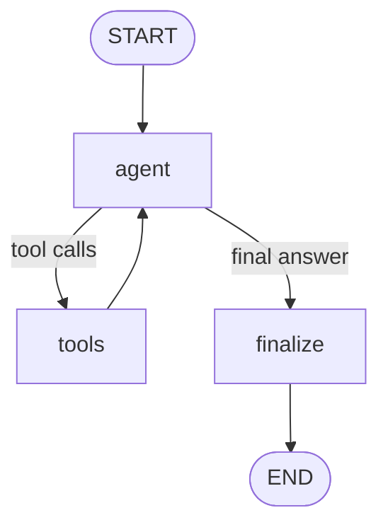
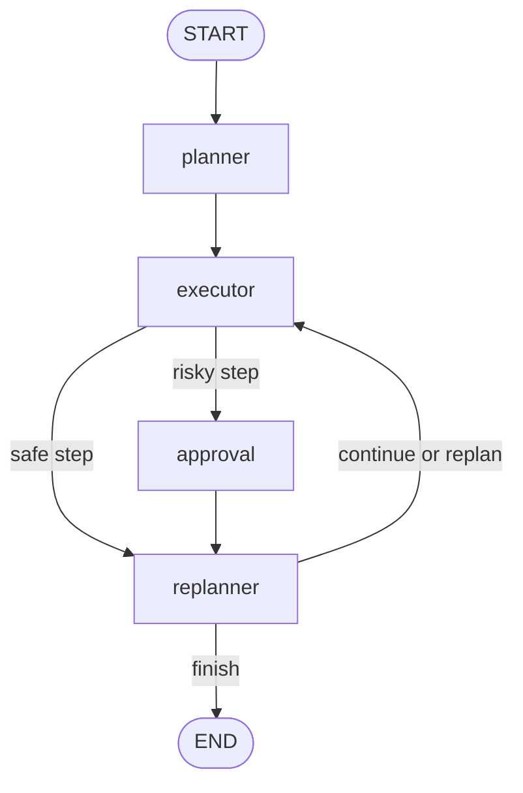

# Практичне завдання №1
## Requirements & Estimation Readiness Agent

Авторка: Anna Malkova
Модель: `gemini-3.1-flash-lite`
Python: `3.13.2`

## 1. Мета роботи

Мета практичного завдання — реалізувати автономного AI-агента,
який підтримує підготовку вимог до estimation та передачу
ініціативи від discovery до delivery-команди.

Рішення демонструє дві агентні архітектури:

1. ReAct: цикл `LLM → tools → LLM`.
2. Plan-and-Execute: `planner → executor → replanner`.

Додатково реалізовано:

- Pydantic-валидацію domain tools;
- safety limits;
- Agentic RAG із ChromaDB;
- SQLite persistence;
- Human-in-the-Loop для ризикової операції;
- JSON trajectory logging;
- числове порівняння ReAct і Plan-and-Execute;
- Mermaid-візуалізацію графів;
- unit та integration tests.

## 2. Бізнес-контекст

Агент працює на етапі між discovery та delivery estimation.

Його завдання:

- перевіряти готовність requirements package;
- визначати estimation complexity;
- знаходити gaps перед handover;
- шукати правила у knowledge base;
- передавати estimation request до delivery-команди;
- блокувати ризикову відправку без підтвердження людини.

Це логічне продовження процесу:

```text
Demand → Discovery → Requirements Readiness → Estimation → Delivery
```

## 3. Архітектура ReAct



ReAct-агент самостійно:

1. аналізує запит;
2. вирішує, чи потрібен tool;
3. формує tool arguments;
4. отримує observation;
5. продовжує reasoning;
6. формує структуровану відповідь.

Ризиковий `submit_estimation_request` не входить до набору
звичайних ReAct tools і виконується лише у Plan-and-Execute
через HITL.

## 4. Архітектура Plan-and-Execute



### Planner

Формує структурований `Plan`:

- `goal`;
- від одного до шести послідовних steps;
- кожен step починається з точної назви tool;
- аргументи не вигадуються та не скорочуються.

### Executor

Виконує один plan step за один цикл.

Для безпечних операцій використовується вкладений ReAct-агент.
Таким чином Plan-and-Execute виконує domain steps через
окремий цикл `LLM → tool → LLM`.

### Replanner

Після кожного кроку приймає структуроване рішення:

- `continue`;
- `replan`;
- `finish`.

Кількість перебудов плану обмежена трьома. Якщо LLM не формує
фінальну відповідь після останнього кроку, використовується
детермінований fallback із накопичених результатів.

### Approval

Окремий вузол використовується перед
`submit_estimation_request`.

Він підтримує:

- `approve`;
- `reject`;
- `edit`.

Tool не виконується до явного підтвердження людиною.

## 5. Domain tools

| Tool | Призначення | Ризик |
|---|---|---|
| `check_requirements_readiness` | Перевіряє повноту requirements package | Low |
| `classify_estimation_complexity` | Розраховує Fibonacci points та complexity | Low |
| `identify_handover_gaps` | Визначає gaps і blockers перед handover | Low |
| `submit_estimation_request` | Записує та відправляє estimation request | High |
| `search_delivery_knowledge` | Виконує semantic search у ChromaDB | Low |

Кожен domain tool:

- має окрему Pydantic v2 input schema;
- використовує `BaseModel`, `Field`, `field_validator` та
  `model_validator`;
- забороняє зайві поля через `extra="forbid"`;
- нормалізує `initiative_id`;
- повертає стандартний JSON:

```json
{
  "status": "success",
  "data": {},
  "error": null
}
```

Для помилок:

```json
{
  "status": "error",
  "data": null,
  "error": "Опис помилки"
}
```

## 6. Safety

Для ReAct реалізовано:

- `max_steps = 10`;
- загальний `timeout = 120` секунд;
- максимум два однакові tool calls;
- canonical signature для порівняння tool name та arguments;
- окремий статус `safety_stop`;
- safety snapshot у фінальній відповіді.

Safety limits покриваються автоматичними тестами.

## 7. Agentic RAG

Knowledge base реалізована через persistent ChromaDB.

Collection:

```text
requirements_estimation_knowledge
```

Кількість документів:

```text
12
```

Тематики документів:

- Definition of Ready;
- business objective;
- functional requirements;
- non-functional requirements;
- acceptance criteria;
- integration readiness;
- data migration;
- security review;
- dependencies;
- estimation sizing;
- handover process;
- human approval policy.

Пошук не запускається автоматично для кожного запиту.
Агент самостійно вирішує, коли потрібен
`search_delivery_knowledge`.

Приклад:

```bash
python knowledge.py
```

## 8. Human-in-the-Loop

Ризикова дія:

```text
submit_estimation_request
```

Перед виконанням LangGraph створює dynamic interrupt із:

- назвою tool;
- risk level;
- усіма arguments;
- повідомленням для людини;
- дозволеними рішеннями.

### Approve

Для `DEM-060` людина підтвердила відправку.

Результат:

```text
request_id: EST-001
status: submitted
used_tools: [submit_estimation_request]
```

### Reject

Для `DEM-061` людина відхилила відправку з причиною:

```text
Потрібне остаточне погодження Delivery Lead.
```

Результат:

```text
status: rejected
used_tools: []
```

`DEM-061` не був записаний у файл відправлених requests.

## 9. SQLite persistence

State зберігається через:

```text
SqliteSaver
```

Файл:

```text
agent_state.db
```

Підтримуються команди:

```bash
python persistence_demo.py start THREAD_ID
python persistence_demo.py inspect THREAD_ID
python persistence_demo.py resume THREAD_ID
python persistence_demo.py compare THREAD_A THREAD_B
```

Практична демонстрація:

- `practice-persistence-001` залишився у стані `running`;
- `practice-persistence-002` був відновлений і завершений;
- зміни другого thread не вплинули на перший;
- `threads_are_independent = true`;
- `state_values_differ = true`;
- `progress_is_independent = true`.

## 10. Trajectory logging

Файл:

```text
trajectory.json
```

Він містить два типи запусків:

1. `react`;
2. `plan_execute`.

Для кожного run зберігаються:

- `run_id`;
- timestamp;
- agent type;
- user input;
- serialized messages;
- tool calls;
- final response;
- safety metrics;
- metadata.

Поточний результат:

```text
react        | 6 messages | 3 tools
plan_execute | 6 messages | 3 tools
```

## 11. Порівняння архітектур

Обидві архітектури виконано на одному сценарії.

| Метрика | ReAct | Plan-and-Execute |
|---|---:|---:|
| Status | completed | completed |
| Quality score | 100% | 100% |
| Tool coverage | 100% | 100% |
| Tool calls | 3 | 3 |
| Execution time | 6.286 s | 17.793 s |

Різниця latency:

```text
11.507 секунди
```

### Висновок

ReAct був швидшим для короткого запиту, оскільки не витрачав
додаткові LLM-виклики на planner і replanner.

Plan-and-Execute мав ту саму quality score, але надав:

- явний план;
- контроль прогресу;
- replanning;
- persistence;
- окремий HITL workflow;
- кращу керованість довгих сценаріїв.

Один запуск не є статистично репрезентативним benchmark,
оскільки latency залежить від зовнішньої LLM та API load.

Повний звіт:

```text
comparison_results.json
```

## 12. Візуалізація

Mermaid definitions генеруються командою:

```bash
python visualize_graphs.py
```

Артефакти:

```text
react_graph.mmd
plan_execute_graph.mmd
```

## 13. Автоматичні тести

Запуск:

```bash
python -m pytest -q
```

Покрито:

- schema validation;
- normalization;
- invalid inputs;
- tool success та error responses;
- safety limits;
- repeated tool calls;
- ChromaDB initialization та search;
- ReAct LLM–tools–LLM loop;
- Plan-and-Execute execution;
- replanning;
- HITL approve/reject/edit;
- SQLite restart;
- thread independence;
- architecture comparison metrics.

Поточний результат:

```text
59 passed
```

Для цього проєкту важливо використовувати:

```bash
python -m pytest
```

а не глобальний `pytest`, оскільки глобальна команда може
посилатися на інше Python environment.

## 14. Встановлення

```bash
cd practice_1

python3 -m venv .venv
source .venv/bin/activate

python -m pip install -r requirements.txt
```

Створити `.env` на основі `.env.example`:

```bash
cp .env.example .env
```

Додати один Gemini API key:

```text
GOOGLE_API_KEY=your_key_here
```

Файл `.env` і virtual environment не додаються до Git.

## 15. Запуск

### ReAct

```bash
python react_agent.py
```

### Plan-and-Execute

```bash
python plan_execute.py
```

### Knowledge base

```bash
python knowledge.py
```

### Persistence demo

```bash
python persistence_demo.py --help
```

### Architecture comparison

```bash
python compare_agents.py
```

### Graph visualization

```bash
python visualize_graphs.py
```

## 16. Структура проєкту

```text
practice_1/
├── README.md
├── requirements.txt
├── .env.example
├── tools.py
├── safety.py
├── knowledge.py
├── trajectory_logger.py
├── react_agent.py
├── plan_execute.py
├── hitl.py
├── persistence_demo.py
├── compare_agents.py
├── visualize_graphs.py
├── test_runner.py
├── test_tools.py
├── test_safety.py
├── test_knowledge.py
├── test_react_agent.py
├── test_plan_execute.py
├── test_hitl.py
├── test_persistence.py
├── test_compare_agents.py
├── trajectory.json
├── comparison_results.json
├── test_results.json
├── agent_state.db
├── react_graph.mmd
├── plan_execute_graph.mmd
└── Task_001_Malkova_Requirements_Estimation.ipynb
```

## 17. Bonus criteria

Реалізовано:

1. Числове порівняння ReAct та Plan-and-Execute.
2. Mermaid-візуалізація обох LangGraph graphs.
3. Fallback strategy для завершення Plan-and-Execute.
4. Replanning після помилок або зміни контексту.

## 18. Обмеження

- Використовується локальний mock storage замість Jira API.
- Knowledge base містить навчальний набір документів.
- Latency залежить від Gemini API.
- Free-tier quota може обмежувати частоту live-тестів.
- SQLite підходить для локального demo, але не для
  distributed production deployment.
- Для production потрібні authentication, authorization,
  audit logging, monitoring та централізоване сховище.
- Поточна quality score є детермінованою acceptance metric,
  а не повною LLM-as-a-judge evaluation.

## 19. Основні артефакти

| Артефакт | Призначення |
|---|---|
| `Task_001_Malkova_Requirements_Estimation.ipynb` | Основний notebook |
| `trajectory.json` | Траєкторії двох агентів |
| `agent_state.db` | Persistent LangGraph checkpoints |
| `comparison_results.json` | Числове порівняння |
| `test_results.json` | Acceptance report |
| `react_graph.mmd` | Візуалізація ReAct |
| `plan_execute_graph.mmd` | Візуалізація Plan-and-Execute |
| `README.md` | Документація та інструкції |