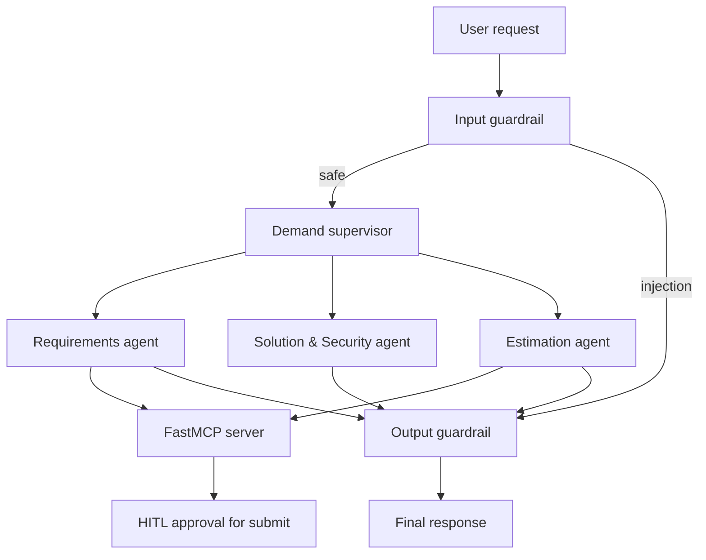

# Practical Assignment 2: Requirements & Estimation MAS

**Автор:** Anna Malkova  
**Курс:** Autonomous Agent Design  
**Домен:** Demand Management / Requirements & Estimation  
**LLM:** Google Gemini (`gemini-3.1-flash-lite`)

## 1. Опис проєкту

Проєкт реалізує мультиагентну систему для підготовки demand-запитів до estimation handover. Система перевіряє повноту вимог, аналізує solution та security аспекти, визначає складність ініціативи й формує Fibonacci estimation points.

Це продовження Practical Assignment 1 у тому самому домені. У першій практичній роботі було реалізовано автономного ReAct та Plan-and-Execute агента. У Practical Assignment 2 цей кейс розширено до MAS із supervisor routing, MCP integration, guardrails, LangSmith tracing та Human-in-the-Loop.

Один і той самий кейс реалізовано у двох framework:

- LangGraph;
- AG2 v1.

## 2. Бізнес-кейс

До передачі demand-запиту на estimation потрібно:

1. Перевірити повноту business і functional requirements.
2. Виявити прогалини у solution handover.
3. Перевірити NFR, security, integrations і data ownership.
4. Визначити estimation complexity.
5. Розрахувати Fibonacci points.
6. Передати estimation request цільовій команді лише після підтвердження людиною.

Ідентифікатори ініціатив використовують формат `DEM-001`.

## 3. Архітектура



### 3.1 Агенти

| Agent | Відповідальність | Доступні tools |
|---|---|---|
| `demand_supervisor` | Класифікує запит і виконує handoff | Немає |
| `requirements_agent` | Перевіряє readiness і handover gaps | `check_requirements_readiness`, `identify_handover_gaps` |
| `solution_security_agent` | Аналізує NFR, integrations, data та security | Немає side-effect tools |
| `estimation_agent` | Визначає complexity і Fibonacci points | `classify_estimation_complexity` |
| HITL workflow | Контролює ризикову submission operation | `submit_estimation_request` після approval |

Supervisor передає запит лише одному спеціалісту. Це зменшує кількість model calls і не передає кожному агенту непотрібні tool schemas.

### 3.2 LangGraph workflow

LangGraph реалізація містить:

- typed `MASState`;
- input guardrail node;
- supervisor node зі structured `RouteDecision`;
- три specialist nodes;
- conditional routing;
- output guardrail node;
- trajectory events;
- checkpointer-compatible state;
- окремий HITL graph для ризикового tool.

Основний маршрут:

```text
START
  → input_guardrail
  → demand_supervisor
  → selected specialist
  → output_guardrail
  → END
```

### 3.3 AG2 workflow

AG2 v1 реалізація використовує:

- чотири нативні `ag2.Agent`;
- structured supervisor response;
- явний asynchronous coordinator;
- один handoff до вибраного specialist;
- callable adapters до того самого MCP client;
- native `AgentReply.usage()` для token measurement.

AG2 `Network/Hub` не використовується, оскільки у версії 1.0.2 це infrastructure-level API з registry, storage, passports і channels. Для локального supervisor pattern явний coordinator є компактнішим і краще порівнюється з LangGraph.

## 4. MCP Server

Файл `mcp_server.py` містить кастомний FastMCP server із чотирма domain tools.

| MCP tool | Призначення | Risk |
|---|---|---|
| `check_requirements_readiness` | Перевіряє заповнення обов’язкових requirements | Low |
| `classify_estimation_complexity` | Розраховує score, complexity і Fibonacci points | Low |
| `identify_handover_gaps` | Виявляє blocking controls та known blockers | Low |
| `submit_estimation_request` | Зберігає estimation request | High, HITL required |

Усі аргументи проходять Pydantic v2 validation. Domain tools повертають стандартизовану JSON-структуру:

```json
{
  "status": "success",
  "data": {},
  "error": null
}
```

MCP integration:

- LangGraph: `langchain-mcp-adapters`;
- AG2: typed callable adapters, які делегують виклики до `mcp_client.py`;
- transport: `stdio`;
- server: `FastMCP 3.4.7`.

## 5. Guardrails і security hardening

### 5.1 Input guardrail

`guardrails.py` перевіряє direct та indirect prompt injection, зокрема:

- ignore previous instructions;
- reveal system prompt;
- bypass security;
- jailbreak;
- виконання інструкцій із недовіреного зовнішнього тексту.

Небезпечний запит блокується до supervisor/model invocation.

### 5.2 Tool guardrail

Для кожного агента визначено окремий allowlist.

| Agent | Allowed tools |
|---|---|
| `demand_supervisor` | none |
| `requirements_agent` | readiness, handover gaps |
| `solution_security_agent` | none |
| `estimation_agent` | complexity, submission through HITL |

Tool guardrail перевіряє:

1. Чи зареєстрований agent.
2. Чи існує tool.
3. Чи є tool в allowlist.
4. Чи проходять arguments відповідну Pydantic schema.
5. Чи потребує tool human approval.

### 5.3 Output guardrail

Output guardrail рекурсивно обробляє strings, dictionaries і lists та редагує:

- email addresses;
- phone numbers.

Приклад:

```text
anna@example.com → [REDACTED_EMAIL]
+380 67 123 45 67 → [REDACTED_PHONE]
```

### 5.4 Basic red-teaming

Автоматизовані тести перевіряють:

- direct prompt injection;
- indirect prompt injection;
- unauthorized tool access;
- invalid tool arguments;
- risky tool без approval;
- email і phone leakage;
- nested PII structures.

## 6. Human-in-the-Loop

`submit_estimation_request` є ризиковим tool, оскільки створює persistent business record.

Перед виконанням LangGraph викликає `interrupt()`. Людина може:

- `approve` — виконати tool із початковими аргументами;
- `reject` — завершити workflow без side effect;
- `edit` — змінити аргументи, повторно пройти Pydantic validation і лише потім виконати tool.

State зберігається через checkpointer. Side effect не виконується до позитивного рішення людини.

## 7. Observability і tracing

### 7.1 LangGraph trace

LangGraph і LangChain components автоматично трасуються через LangSmith.

Файл запуску:

```text
tracing_config.py
```

Зафіксований trace:

```text
artifacts/langsmith_trace.json
```

Структура trace включає:

- input guardrail;
- demand supervisor;
- estimation agent;
- Gemini model calls;
- MCP tool call;
- output guardrail.

Виміряний результат:

| Metric | Value |
|---|---:|
| Runs | 17 |
| LLM calls | 3 |
| Prompt tokens | 1,214 |
| Completion tokens | 464 |
| Total tokens | 1,678 |

### 7.2 AG2 trace

AG2 v1 instrumented вручну через LangSmith `traceable`.

Файл запуску:

```text
tracing_ag2.py
```

Зафіксований trace:

```text
artifacts/ag2_langsmith_trace.json
```

Основні spans:

```text
ag2_requirements_estimation_mas
├── ag2_demand_supervisor
└── ag2_specialist
    └── classify_estimation_complexity
```

AG2 token usage додатково збережено у:

```text
artifacts/ag2_usage.json
```

## 8. Порівняння LangGraph та AG2

Повний відтворюваний звіт:

```text
artifacts/framework_comparison.md
artifacts/framework_metrics.json
```

### 8.1 Архітектурне порівняння

| Criterion | LangGraph | AG2 v1 |
|---|---|---|
| Coordination | Explicit nodes і conditional edges | Programmatic async coordinator |
| Control | High | Medium-high |
| State | Typed shared `MASState` | `AgentReply` + `AG2MASResult` |
| Handoff | Conditional graph transition | Direct call selected `Agent` |
| Debugging | Graph state, trajectory, LangSmith hierarchy | Python call stack, structured replies, manual trace |
| HITL | Native interrupt + checkpointer | Hook/middleware available; shared HITL workflow reused |
| Boilerplate | Higher | Lower |
| Best fit | Stateful branching workflows | Compact supervisor/specialist systems |

### 8.2 Виміряне споживання токенів

Обидва framework запускалися з однаковою моделлю та еквівалентним estimation request.

| Framework | LLM calls | Prompt tokens | Completion tokens | Total tokens |
|---|---:|---:|---:|---:|
| LangGraph | 3 | 1,214 | 464 | 1,678 |
| AG2 v1 | 3 | 1,274 | 413 | 1,687 |

AG2 використав на 9 total tokens більше, різниця становить приблизно 0.54%. Для одного запуску token efficiency практично однакова. Це snapshot, а не статистично значущий benchmark, оскільки довжина model output є стохастичною.

### 8.3 Висновок порівняння

LangGraph обрано основною реалізацією, тому що workflow потребує:

- явних security gates;
- trajectory state;
- deterministic routing;
- interrupt/resume;
- контрольованого side effect;
- зручного debugging у trace tree.

AG2 є компактнішою альтернативою для supervisor plus specialists pattern і вимагає менше orchestration code.

## 9. Структура проєкту

```text
practice_2/
├── artifacts/
│   ├── ag2_langsmith_trace.json
│   ├── ag2_usage.json
│   ├── framework_comparison.md
│   ├── framework_metrics.json
│   ├── langsmith_trace.json
│   └── pytest_output.txt
├── tests/
│   ├── test_guardrails.py
│   ├── test_hitl.py
│   ├── test_mas.py
│   ├── test_mas_ag2.py
│   └── test_mcp_server.py
├── build_notebook.py
├── compare_frameworks.py
├── domain_tools.py
├── guardrails.py
├── hitl.py
├── mas_ag2.py
├── mas_langgraph.py
├── mcp_client.py
├── mcp_server.py
├── tracing_ag2.py
├── tracing_config.py
├── .env.example
├── .gitignore
├── README.md
└── requirements.txt
```

## 10. Встановлення

### 10.1 Створення environment

```bash
python3 -m venv .venv
source .venv/bin/activate
python -m pip install --upgrade pip
pip install -r requirements.txt
```

### 10.2 Environment variables

```bash
cp .env.example .env
```

Заповнити локальний `.env`:

```dotenv
GOOGLE_API_KEY=
MODEL_NAME=gemini-3.1-flash-lite

LANGSMITH_TRACING=true
LANGSMITH_API_KEY=
LANGSMITH_PROJECT=practice-2-malkova-demand-mas
LANGSMITH_ENDPOINT=https://api.smith.langchain.com
```

`.env` додано до `.gitignore`. API keys не повинні потрапляти до repository або trace artifacts.

## 11. Запуск

### MCP server

```bash
python mcp_server.py
```

### MCP adapter demonstration

```bash
python mcp_client.py
```

### LangGraph MAS

```bash
python mas_langgraph.py
```

### AG2 MAS

```bash
python mas_ag2.py
```

### LangGraph trace

```bash
python tracing_config.py
```

### AG2 trace

```bash
python tracing_ag2.py
```

### Framework comparison

```bash
python compare_frameworks.py
```

### Notebook generation

```bash
python build_notebook.py
```

Результат:

```text
Task_002_Malkova_Requirements_Estimation_MAS.ipynb
```

## 12. Тестування

Повний запуск:

```bash
python -m pytest -v
```

Фактичний результат:

```text
30 passed in 3.70s
```

Повний вивід pytest збережено у `artifacts/pytest_output.txt`.

Розподіл тестів:

| Component | Test cases |
|---|---:|
| MCP server | 6 |
| Guardrails | 9 |
| HITL | 3 |
| LangGraph MAS | 7 |
| AG2 MAS | 5 |
| Total | 30 |

Тести не потребують live Gemini calls. LLM і agent runners замінено deterministic fakes там, де перевіряється orchestration behavior.

## 13. Аналітичні відповіді

### Чому обрано supervisor architecture?

Domain request може стосуватися requirements, solution/security або estimation. Supervisor централізує routing policy, не дозволяє агентам довільно передавати керування та забезпечує один контрольований handoff. Це робить trajectory короткою і пояснюваною.

### Чому domain tools винесено в MCP?

MCP відокремлює business capabilities від конкретного agent framework. LangGraph та AG2 використовують один server і ті самі Pydantic rules. Це усуває дублювання domain logic та дозволяє замінити orchestration framework без переписування tools.

### Коли LangGraph кращий за AG2?

LangGraph кращий для workflows із branching, persisted state, deterministic transitions, security gates та interrupt/resume. AG2 зручніший, коли потрібна компактна agent-centric orchestration без складного state machine.

### Які основні security risks?

Основні ризики:

- direct та indirect prompt injection;
- excessive agency;
- unauthorized tool calls;
- некоректні або вигадані arguments;
- PII leakage;
- виконання side effect без business approval;
- sensitive data у traces.

Ризики зменшуються через layered guardrails, least-privilege tool access, Pydantic validation, synthetic trace data та HITL.

### Чому `submit_estimation_request` потребує HITL?

Tool створює persistent запис, який може впливати на planning, capacity та комунікацію з delivery team. Помилкова submission має бізнес-наслідки. Тому model може підготувати arguments, але остаточне рішення залишається за людиною.

### Що показав tracing?

Trace підтвердив:

- injection check виконується до model call;
- supervisor робить один handoff;
- тільки estimation agent отримує complexity tool;
- MCP round trip додає третій model call;
- output guardrail виконується після specialist;
- обидва framework мають майже однакове token consumption для еквівалентного кейсу.

## 14. Обмеження

- Supervisor виконує один handoff, а не multi-specialist collaboration.
- Token comparison базується на одному measured run.
- FastMCP stdio client створює окремі короткоживучі server sessions.
- Gemini SDK показує non-blocking AFC/schema warnings.
- Synthetic examples не замінюють production red-team exercise.
- Persistent submission storage у навчальній версії є локальним JSON-файлом.
- Production deployment потребує authentication, secrets manager, durable database, audit retention policy та role-based approval UI.

## 15. Результат

Реалізовано всі обов’язкові компоненти Practical Assignment 2:

- LangGraph MAS із supervisor і трьома specialist agents;
- той самий кейс у AG2 v1;
- FastMCP server із чотирма tools;
- MCP integration у двох framework;
- tracing для LangGraph і AG2;
- input, tool та output guardrails;
- basic red-teaming;
- HITL approve/reject/edit;
- framework і token comparison;
- 30 automated tests.